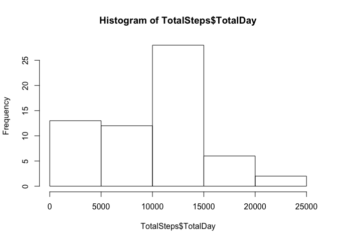
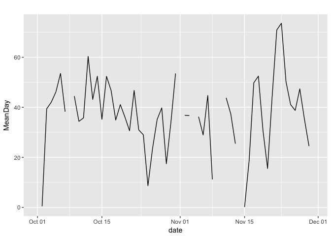
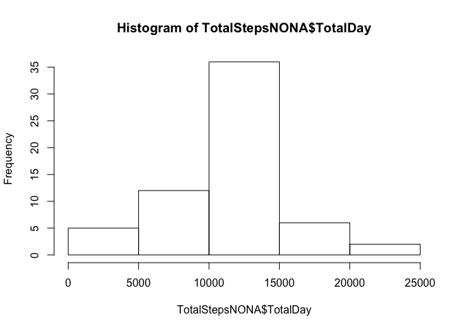
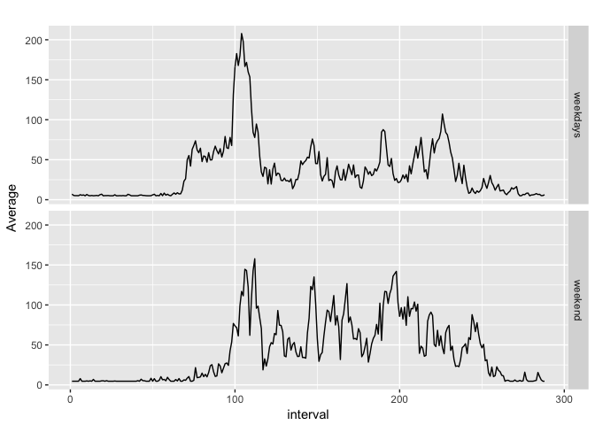

##Introduction

It is now possible to collect a large amount of data about personal movement using activity monitoring devices such as a Fitbit, Nike Fuelband, or Jawbone Up. These type of devices are part of the “quantified self” movement – a group of enthusiasts who take measurements about themselves regularly to improve their health, to find patterns in their behavior, or because they are tech geeks. But these data remain under-utilized both because the raw data are hard to obtain and there is a lack of statistical methods and software for processing and interpreting the data.

This assignment makes use of data from a personal activity monitoring device. This device collects data at 5 minute intervals through out the day. The data consists of two months of data from an anonymous individual collected during the months of October and November, 2012 and include the number of steps taken in 5 minute intervals each day.


## Loading libraries and data

```r
library(tidyverse)
library(impute)
Steps <- read_csv("activity.csv")
```

## What is mean total number of steps taken per day?  
1. Calculate the total number of steps taken per day  

```r
TotalSteps <- Steps %>% 
    group_by(date) %>% 
    summarize(TotalDay = sum(steps, na.rm = TRUE))
head(TotalSteps)
```

```
## # A tibble: 6 x 2
##   date       TotalDay
##   <date>        <int>
## 1 2012-10-01        0
## 2 2012-10-02      126
## 3 2012-10-03    11352
## 4 2012-10-04    12116
## 5 2012-10-05    13294
## 6 2012-10-06    15420
```

2. Make a histogram of the total number of steps taken each day  

```r
hist(TotalSteps$TotalDay)
```

<!-- -->

3. Calculate and report the mean and median of the total number of steps taken per day

```r
TotalSteps <- Steps %>% 
    group_by(date) %>% 
    summarize(TotalDay = sum(steps, na.rm = TRUE), MeanDay = mean(steps, na.rm = TRUE), MedianDay = median(steps, na.rm = TRUE))
head(TotalSteps)
```

```
## # A tibble: 6 x 4
##   date       TotalDay MeanDay MedianDay
##   <date>        <int>   <dbl>     <dbl>
## 1 2012-10-01        0 NaN            NA
## 2 2012-10-02      126   0.438         0
## 3 2012-10-03    11352  39.4           0
## 4 2012-10-04    12116  42.1           0
## 5 2012-10-05    13294  46.2           0
## 6 2012-10-06    15420  53.5           0
```

## What is the average daily activity pattern?  
1. Make a time series plot (i.e. type="l") of the 5-minute interval (x-axis) and the average number of steps taken, averaged across all days (y-axis)

```r
ggplot(TotalSteps, aes(x = date, y = MeanDay)) +
    geom_line() + 
    ggtitle("")
```

```
## Warning: Removed 2 rows containing missing values (geom_path).
```

<!-- -->

2. Which 5-minute interval, on average across all the days in the dataset, contains the maximum number of steps?

```r
Steps[which(Steps$steps == max(Steps$steps, na.rm=TRUE)),]
```

```
## # A tibble: 1 x 3
##   steps date       interval
##   <int> <date>        <int>
## 1   806 2012-11-27      615
```

## Imputing missing values  
1. Calculate and report the total number of missing values in the dataset (i.e. the total number of rows with NAs)

```r
nrow(Steps) - sum(complete.cases(Steps))
```

```
## [1] 2304
```

2. Devise a strategy for filling in all of the missing values in the dataset. The strategy does not need to be sophisticated. For example, you could use the mean/median for that day, or the mean for that 5-minute interval, etc.
Analyzing:

```r
Steps %>% group_by(date) %>% summarise(AreNA = sum(is.na(steps)), NotNA = sum(!is.na(steps)))
```

```
## # A tibble: 61 x 3
##    date       AreNA NotNA
##    <date>     <int> <int>
##  1 2012-10-01   288     0
##  2 2012-10-02     0   288
##  3 2012-10-03     0   288
##  4 2012-10-04     0   288
##  5 2012-10-05     0   288
##  6 2012-10-06     0   288
##  7 2012-10-07     0   288
##  8 2012-10-08   288     0
##  9 2012-10-09     0   288
## 10 2012-10-10     0   288
## # ... with 51 more rows
```
We see that NA are on whole day so, I decide to fill those days with the average done on all days.

3. Create a new dataset that is equal to the original dataset but with the missing data filled in.

```r
#Calculation of average 
Average <- round(mean(Steps$steps, na.rm = TRUE))
#Creation of new data.frame with NA set to average
StepsNONA <- Steps
StepsNONA$steps[which(is.na(StepsNONA$steps))] = Average
```

4. Make a histogram of the total number of steps taken each day and Calculate and report the mean and median total number of steps taken per day. 

```r
TotalStepsNONA <- StepsNONA %>% 
    group_by(date) %>% 
    summarize(TotalDay = sum(steps, na.rm = TRUE), MeanDay = mean(steps, na.rm = TRUE), MedianDay = median(steps, na.rm = TRUE))
hist(TotalStepsNONA$TotalDay)
```

<!-- -->

```r
head(TotalStepsNONA)
```

```
## # A tibble: 6 x 4
##   date       TotalDay MeanDay MedianDay
##   <date>        <dbl>   <dbl>     <dbl>
## 1 2012-10-01    10656  37            37
## 2 2012-10-02      126   0.438         0
## 3 2012-10-03    11352  39.4           0
## 4 2012-10-04    12116  42.1           0
## 5 2012-10-05    13294  46.2           0
## 6 2012-10-06    15420  53.5           0
```
Do these values differ from the estimates from the first part of the assignment? What is the impact of imputing missing data on the estimates of the total daily number of steps?

Median is zero all days, except the days wherwe have assigned mean value.

## Are there differences in activity patterns between weekdays and weekends?  
1. Create a new factor variable in the dataset with two levels – “weekday” and “weekend” indicating whether a given date is a weekday or weekend day.

```r
StepsNONA <- StepsNONA %>%
    mutate(DayWeek = weekdays(date))
StepsNONA$Weekend <- "weekday"
StepsNONA$Weekend[which(grepl("^S", StepsNONA$DayWeek))] <- "weekend"
```
2. Make a panel plot containing a time series plot (i.e. type = "l") of the 5-minute interval (x-axis) and the average number of steps taken, averaged across all weekday days or weekend days (y-axis). 

```r
StepsNONA_Weekdays <- StepsNONA %>%
    filter(Weekend == "weekday")
Avg_StepsNONA_Weekdays <- tapply(StepsNONA_Weekdays$steps, StepsNONA_Weekdays$interval, mean)
StepsNONA_Weekend <- StepsNONA %>%
    filter(Weekend == "weekend")
Avg_StepsNONA_Weekend <- tapply(StepsNONA_Weekend$steps, StepsNONA_Weekend$interval, mean)
Avg_StepsNONA <- bind_rows(tibble(
    interval = c(1:length(Avg_StepsNONA_Weekdays)), 
    Average = Avg_StepsNONA_Weekdays, 
    Weekend = rep("weekdays", length(Avg_StepsNONA_Weekdays))), 
    tibble(
    interval = c(1:length(Avg_StepsNONA_Weekend)), 
    Average = Avg_StepsNONA_Weekend, 
    Weekend = rep("weekend", length(Avg_StepsNONA_Weekend))))
ggplot(Avg_StepsNONA, aes(x = interval, y = Average)) +
    geom_line() + 
    facet_grid(Weekend ~ .) +
    ggtitle("")
```

<!-- -->
